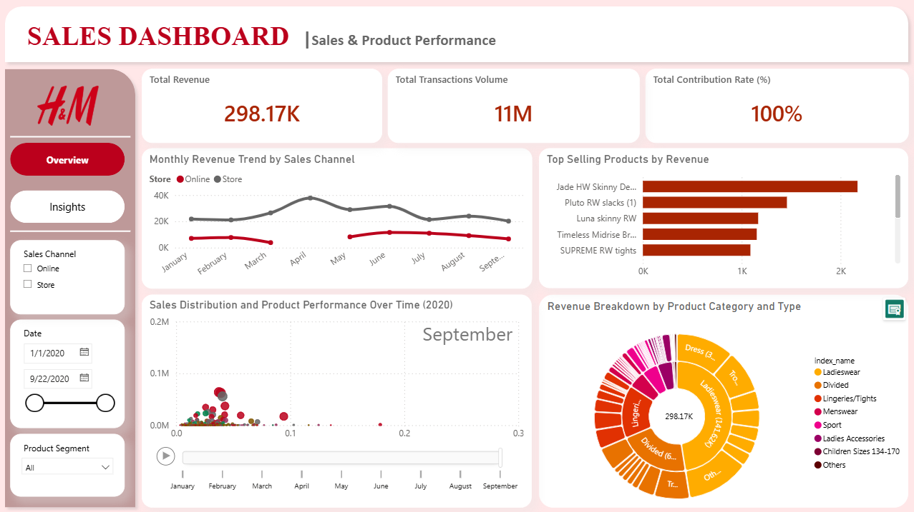
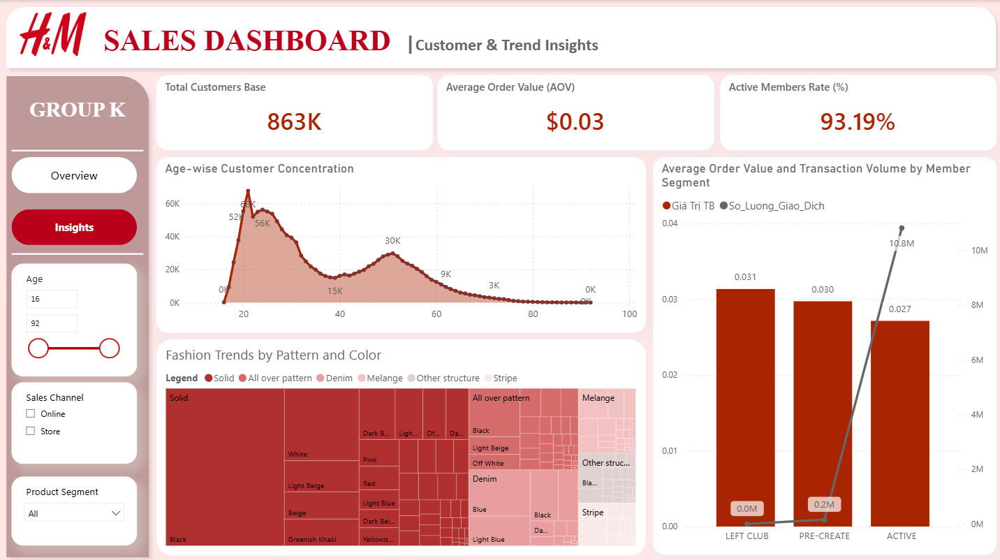

# H&M Retail Analytics Dashboard (Data 2020)

## 1. Giới thiệu & Mục tiêu dự án
Dự án xây dựng một bức tranh phân tích đa chiều về hành vi khách hàng và hiệu quả kinh doanh của H&M trong năm 2020 dựa trên tập dữ liệu hơn 11 triệu giao dịch. Dashboard tập trung chuyển hóa dữ liệu vận hành thành các insight chiến lược giúp tối ưu hóa doanh thu, đánh giá vai trò của cá nhân hóa và quản trị danh mục sản phẩm thời trang.

* **Công cụ sử dụng:** Power BI Desktop, DAX, Power Query.
* **Mô hình dữ liệu:** Star Schema (Bảng Fact Giao dịch kết hợp các bảng Dimension Khách hàng, Sản phẩm, Thời gian).

## 2. Link Tương Tác Trực Tiếp
[Nhấn vào đây để xem và tương tác với Dashboard trực tuyến](https://app.powerbi.com/groups/me/reports/80c3b30a-0823-4981-b3dd-5c29eed78680/3961f166d792b3042fc1?experience=power-bi) 

## 3. Giao diện Dashboard & Các Chỉ số Key KPI

### Trang 1: Dashboard Overview (Tổng quan vận hành)
Trang này hỗ trợ giám sát hiệu quả vận hành tổng thể, cơ cấu doanh thu theo ngành hàng và so sánh hiệu suất giữa hai kênh bán hàng Online và Store.
* **Total Revenue:** 298.17 nghìn
* **Total Transactions:** 11 triệu
* **Contribution:** 100% (Hỗ trợ tương tác cập nhật tự động theo phân khúc)

### Trang 2: Dashboard Insights (Hành vi khách hàng & Xu hướng)
Trang này tập trung làm rõ mối quan hệ giữa hành vi khách hàng theo độ tuổi, trạng thái thành viên và xu hướng thị hiếu thẩm mỹ đối với sản phẩm.

## 4. Các Insight Kinh Doanh Trọng Yếu Rút Ra

* **Hiệu quả kênh phân phối (Online vs. Store):** Kênh cửa hàng truyền thống (Store) luôn duy trì mức doanh thu cao vượt trội và thể hiện biên độ biến động mạnh theo tính mùa vụ (đạt đỉnh vào tháng 4). Kênh Online đóng vai trò bổ trợ ổn định và có xu hướng tăng trưởng mượt hơn ở giai đoạn giữa năm (đạt đỉnh tháng 6).
* **Cơ cấu danh mục sản phẩm:** Doanh thu tập trung rất cao vào ngành hàng **Ladieswear** (chiếm ~47.5% tổng doanh thu, đạt xấp xỉ 141.62K). Trong đó, **Dress** (Váy) và **Trousers** (Quần) là hai "mã hàng mỏ neo" dẫn dắt toàn bộ doanh số của phân khúc đồ nữ. Nhóm hàng **Divided** (thời trang trẻ) đóng góp 21.1% với cấu trúc doanh thu phân tán đều, phù hợp chiến lược kéo độ phủ thương hiệu.
* **Bản chất hành vi chi tiêu theo nhóm thành viên:** Nhóm thành viên **ACTIVE** (đang hoạt động) chiếm tỷ lệ gắn kết cực lớn (93.19%) với số lượng giao dịch khổng lồ đạt **10.8 triệu giao dịch**, tuy nhiên giá trị đơn hàng trung bình (AOV) lại thấp nhất (~0.027). Ngược lại, nhóm đã rời câu lạc bộ (**LEFT CLUB**) có AOV cao nhất (~0.031) nhưng tần suất mua gần như bằng không. 
* **Xu hướng thiết kế & Thị hiếu thẩm mỹ:** Biểu đồ Treemap chỉ ra sự áp đảo tuyệt đối của **họa tiết trơn (Solid)** và các gam màu trung tính cơ bản như **Black, White, Beige, Blue (Denim)**. Điều này chứng minh hiệu suất thương mại cao gắn liền với các thiết kế tối giản, dễ phối và ít bị lỗi thời theo thời gian.

## 5. Đề xuất Chiến lược cho Doanh nghiệp (Actionable Recommendations)
1. **Bảo toàn nguồn cung chủ lực:** Thiết lập ngưỡng tái đặt hàng (Reorder Point) an toàn cao hơn cho các dòng sản phẩm Denim, Trousers và Dress thuộc Ladieswear để tránh rủi ro gián đoạn doanh thu do thiếu hàng.
2. **Chiến lược giá & Bán kèm để nâng AOV:** Tận dụng tỷ lệ thành viên Active cao để triển khai các gói sản phẩm kết hợp (Bundle) dạng "Quần + Áo thun cơ bản" hoặc đưa ra các ưu đãi theo ngưỡng giỏ hàng nhằm kích thích tăng chỉ số AOV của nhóm này mà không làm giảm tần suất mua sắm.
3. **Phát triển chiều sâu kênh Online:** Chuyển trọng tâm từ tăng lưu lượng truy cập sang cá nhân hóa gợi ý sản phẩm trực tuyến (màu sắc cơ bản, họa tiết trơn) để tăng tỷ lệ chốt đơn và tối ưu hóa trải nghiệm mua sắm đa kênh (Cross-channel).

## 6. Hướng dẫn sử dụng tài nguyên trong Repo
* Bạn có thể tải file `.pbix` gốc về máy máy cá nhân.
* Mở bằng **Power BI Desktop** để xem chi tiết cấu trúc bảng dữ liệu (Data Model) và các công thức tính DAX được sử dụng trong dự án.

## 7. Tải File Nguồn Dự Án
Vì dung lượng file Power BI (`.pbix`) vượt quá giới hạn của GitHub, bạn có thể tải file gốc cấu trúc dữ liệu và công thức DAX tại đây:
[Tải file H&M_Retail_Analysis.pbix tại đây](https://drive.google.com/drive/folders/1AJkUCZzDpg1_H_Zqg1nIj_SbOa9eYvzG?usp=sharing)
